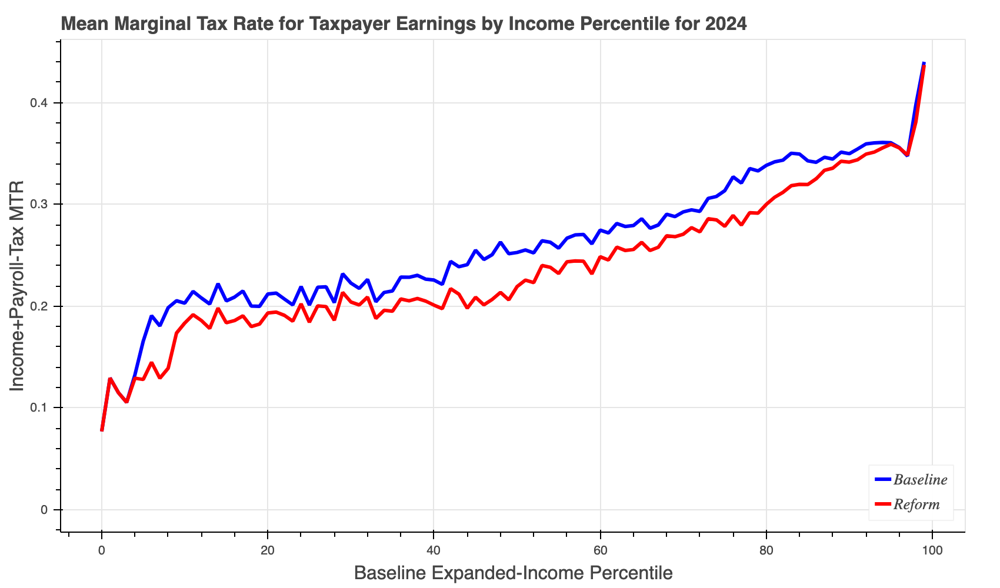

Command-line interface
======================

You can use Tax-Calculator on your own computer via a command-line
interface (CLI) called `tc`.  This approach requires the use of a text
editor to prepare simple files that are read by `tc`.  Computer
programming knowledge is not required, but this approach to using
Tax-Calculator assumes you are willing to work at the command line
(Terminal on Mac or Anaconda Prompt on Windows) and to use a text
editor (for example, TextEdit on Mac or Notepad on Windows).

## Test `tc` CLI

The `tc` CLI is part of the Tax-Calculator `taxcalc` package you
installed on your computer as part of {doc}`../usage/starting`.

To check your installation of `tc`, enter the following command:

```
% tc --test
```

Expected output (after several seconds) is `PASSED TEST`.  If you get
`FAILED TEST`, something went wrong in the installation process. If
the installation test fails, please report your experience by
[creating a new
issue](https://github.com/PSLmodels/Tax-Calculator/issues).

If your installation passes the test, you are ready to begin using
`tc` to analyze tax reforms. Continue reading this section for
information about how to do that. But if you want a quick hint about
the range of `tc` capabilities, enter the following:

```
% tc --help
```

The basic idea of `tc` tax analysis is that each tax reform is
specified in a text file using a simple method to describe the details
of the reform. Read the next part of this section to see how policy
reform files are formatted.

## Specify tax reform

The details of a tax reform are contained in a text file that you
write with a text editor. The reform is expressed by specifying which
tax policy parameters are changed from their current-law values by the
reform. The current-law values of each policy parameter are documented
in [this
section](https://taxcalc.pslmodels.org/guide/policy_params.html#policy-parameters)
of the guide. The timing and magnitude of these policy parameter
changes are written in JSON, a simple and widely-used
data-specification language.

For several examples of reform files and the general rules for writing
JSON reform files, go to [this
page](https://github.com/PSLmodels/Tax-Calculator/blob/master/taxcalc/reforms/README.md#policy-reform-files).

## Specify analysis assumptions

This part explains how to specify economic assumption files used in
static tax analysis. This is an advanced topic, so if you want to
start out using the default assumptions (which are documented in [this
section](https://taxcalc.pslmodels.org/guide/policy_params.html#policy-parameters))
of the guide), you can skip this part now and come back to read it
whenever you want to change the default assumptions. The [next
part](https://taxcalc.pslmodels.org/guide/cli.html#specify-filing-units)
of this section discusses filing-unit input files.

The details of analysis assumptions are contained in a text file that
you write with a text editor. The assumptions are expressed by
specifying which parameters are changed from their default values. The
timing and magnitude of these parameter changes are written in JSON, a
simple and widely-used data-specification language.

For examples of assumption files and the general rules for writing
JSON assumption files, go to [this
page](https://github.com/PSLmodels/Tax-Calculator/blob/master/taxcalc/assumptions/README.md#economic-assumption-files).

## Specify filing units

The `taxcalc` package containing `tc` does not include an
IRS-SOI-PUF-derived microsimulation sample. This is because, unlike
Census public-use files, the IRS-SOI Public Use File is
proprietary. If you or your organization has paid IRS to use the PUF
version being by Tax-Calculator, then it may be possible for us to
share with you one of our PUF-derived samples: the 2011-based  `puf.csv`
or the 2015-based `tmd.csv`, which are described in {doc}`../usage/data`.
Otherwise, you have two choices.

**First**, you can easily create with a text editor a CSV-formatted
file containing several filing units whose experience under your tax
reform is of interest to you. Much of the public discussion of tax
reforms is of this type: how is this family or that family affected by
a reform; how do they fare under different reforms; etc. The test
conducted to check the `tc` installation has left one such file. It is
called `test.csv` and contains two filing units: a lower income family
and a higher income family. You can use this `test.csv` file as `tc`
input to analyze your tax reforms. Before creating your own input
files be sure to read the short set of guidelines that appear after
this list of two choices. Some people pursue this approach using a
statistical pacakge like R or Stata, in which case the `tc` CLI
program can be invoked from within the statistical package. There may
be a need (especially on Windows) to [add to the system
PATH](https://github.com/PSLmodels/Tax-Calculator/issues/2273#issuecomment-479572287)
in order to do this.

**Second**, the `taxcalc` does include a freely available
microsimulation sample containing only filing units derived from a
recent March CPS survey. For several reasons, the results generated by
this `cps.csv` file are substantially different from the results
generated by the `puf.csv` or `tmd.csv` files. The `cps.csv` file
contains a sample of the population while the `puf.csv` and `tmd.csv`
files contain mostly a sample of income tax filers in which
high-income filing units are over represented. Also, the `cps.csv`
file has many income variables that are missing (and assumed to be
zero by Tax-Calculator), which causes an understating of total
incomes, especially for those with high incomes. All these differences
mean that the aggregate revenue and distributional results generated
when using the `cps.csv` file as input to Tax-Calculator can be
substantially different from the results generated when using the
`puf.csv` or `tmd.csv` file as input. And this is particularly true
when analyzing reforms that change the tax treatment of high-income
filers.

**Input-File-Preparation Guidelines**

The `tc` CLI to Tax-Calculator is flexible enough to read almost any
kind of CSV-formatted input data on filing units as long as the
variable names correspond to those expected by Tax-Calculator. The
only required input variables are `RECID` (a unique filing-unit record
identifier) and `MARS` (a positive-valued filing-status
indicator). Other variables in the input file must have variable names
that are listed in the [Input
Variables](https://taxcalc.pslmodels.org/guide/input_vars.html)
section for them to affect the tax calculations. Any variable listed
in Input Variables that is not in an input file is automatically set
to zero for every filing unit. Variables in the input file that are
not listed in Input Variables are ignored by Tax-Calculator.

However, there are important data-preparation issues related to the
fact that the payroll tax is a tax on individuals, not on income-tax
filing units. Tax-Calculator expects that the filing-unit total for
each of several earnings-related variables is split between the
taxpayer and the spouse. It is the responsibility of anyone preparing
data for Tax-Calculator input to do this earnings splitting. Here are
the relationships between the filing-unit variable and the taxpayer
(`p`) and spouse (`s`) variables expected by Tax-Calculator:

```
e00200 = e00200p + e00200s
e00900 = e00900p + e00900s
e02100 = e02100p + e02100s
```

Obviously, when `MARS` is not equal to 2 (married filing jointly), the
values of the three `s` variables are zero and the value of each `p`
variable is equal to the value of its corresponding filing-unit
variable. Note that the input file can omit any one, or all, of these
three sets variables. If the three variables in one of these sets are
omitted, the required relationship will be satisfied because zero
equals zero plus zero.

In addition to this earnings-splitting data-preparation issue,
Tax-Calculator expects that the value of ordinary dividends (`e00600`)
will be no less than the value of qualified dividends (`e00650`) for
each filing unit. And it also expects that the value of total pension
and annuity income (`e01500`) will be no less than the value of
taxable pension and annuity income (`e01700`) for each filing
unit. Tax-Calculator also expects the value of the required MARS
variable to be in the range from one to five, and the value of the EIC
variable to be in the range from zero to three. Again, it is your
responsibility to prepare input data for Tax-Calculator in a way that
ensures these relationships are true for each filing unit.

Here's an example of how to specify a few stylized filing units with
and without young children:

```
RECID,MARS,XTOT,EIC,n24,...
    11   ,  1 ,  1 , 0 , 0 ,... <== single person with no kids
    12   ,  4 ,  2 , 1 , 1 ,... <== single person with a young kid
    13   ,  2 ,  4 , 2 , 2 ,... <== married couple with two young kids
```

Be sure to read the documentation of the `MARS`, `XTOT`, `EIC`, and
`n24` input variables. Also, there may be a need to add other
child-age input variables if you want to simulate reforms like a child
credit bonus for young children. Also, the universal basic income
(UBI) reform is implemented using its own set of three age-group-count
input variables.

The name of your input data file is also relevant to how `tc` will
behave. If your file name ends with `cps.csv`, `puf.csv` or `tmd.csv`,
`tc` will automatically extrapolate your data from its base year to
the year you specify for tax calculations to be calculated using built
in growth factors, extrapolated weights, and other adjustment
factors. If you are not using the `cps.csv`, `puf.csv`, or `tmd.csv`
input, it is likely that your data will not be compatible with these
extrapolations and you should adopt filenames with alternative
endings.

## Initiate reform analysis

Executing `tc` requires at least three command-line arguments: the
name of an input file containing one or more filing units, the year
for which the tax calculations are done, and an option specifying what
kind of output is to be generated.  A baseline policy file is
optional; specifying no baseline file implies the baseline policy is
current-law policy. A policy reform file is optional; specifying no
reform file implies calculations are done for the baseline policy. An
economic assumption file is also optional; no assumption file implies
you want to use the default values of the assumption parameters. The
output files written by `tc` are built-up from the name of the input
file, tax year, baseline file, reform file, and assumption file using
a `#` character if an option is not specified.


Here we explain how to conduct tax analysis with `tc` by presenting a
series of examples and explaining what output is produced in each
example.  There are several types of output that `tc` can generate so
there will be more than a few examples.  All the examples assume that
the input file is the built-in `cps.csv` data sample and are conducted
on an old Mac with a slow Intel CPU chip.

```
% tc cps.csv 2020 --dumpdb
Read input data for 2014; input data were extrapolated to 2020
Write dump output to sqlite3 database file cps-20-#-#-#.db
Execution time is 33.2 seconds
```

The dump database contains 2020 income tax liabilities for each filing
unit under both baseline and reform policy regimes.  The name of the
dump database file is `cps-20-#-#-#.db`.  Because we did not use the
`--dumpvars` option, a minimal set of baseline/reform variables are
included in the dump database.  

The main advantage of the SQLite3 database is that the
Anaconda Python distribution includes
[sqlite3](https://www.sqlite.org/cli.html) (or sqlite3.exe on
Windows), a command-line tool that can be used to tabulate dump output
using structured query language (SQL). SQL is a language that you use
to specify the tabulation you want and the SQL database figures out
the procedure for generating your tabulation and then executes that
procedure; there is no computer programming involved.

To manipulate the dump database file, use the SQLite command-line
program (called `sqlite3.exe` on Windows or` sqlite3` on other
operating systems), which is automatically installed as part of the
Anaconda Python distribution.  Full `sqlite3` documentation is
[here](https://sqlite.org/cli.html).

Here is a quick way to see the structure of the dump database:

```
% echo ".schema" | sqlite3 cps-20-#-#-#.db
CREATE TABLE IF NOT EXISTS "base" (
"RECID" INTEGER,
  "s006" REAL,
  "data_source" INTEGER,
  "XTOT" INTEGER,
  "MARS" INTEGER,
  "expanded_income" REAL,
  "income_group" INTEGER
);
CREATE TABLE IF NOT EXISTS "baseline" (
"RECID" INTEGER,
  "iitax" REAL
);
CREATE TABLE IF NOT EXISTS "reform" (
"RECID" INTEGER,
  "iitax" REAL
);
```

Notice that the dump output includes three relational database tables:
`base`, `baseline`, and `reform`.  The `base` tables contains baseline
values for variables that keep the same value when policy changes.
The `baseline` and `reform` tables can contain variables in addition
to `RECID` and `iitax` if the `--dumpvars` option is used.  For a
complete list of input variables, see the [Input
Variables](https://taxcalc.pslmodels.org/guide/input_vars.html)
section. For a complete list of output variables, see the [Output
Variables](https://taxcalc.pslmodels.org/guide/output_vars.html)
section.

There are several advantages to using a database file for dump output:
the database is much smaller than the equivalent CSV-formatted files,
and dump output can be tabulated using structured query language
(SQL). SQL is a language that you use to specify the tabulation you
want and the SQL database figures out the procedure for generating
your tabulation and then executes that procedure; there is no computer
programming involved.  We illustrate tabulation of dump output in a
[subsequent section](#cli-tab-results).

Next, we show how to generate tabular and graphical output for a
simple policy reform specified in the `ref3.json` file:

```
// ref3.json raises personal exemption amount to 8000 in 2022,
// after which it continues to be indexed to price inflation.
{
    "II_em": {"2022": 8000}
}
```

To get both tabular and graphical output, and to check on the policy
reform, we execute the following commands (note that on Windows you
should replace `cat` with `type`):

```
% tc cps.csv 2024 --reform ref3.json --params --tables --graphs
Read input data for 2014; input data were extrapolated to 2024
Write baseline policy parameter values to file cps-24-#-ref3-#-params.bas
Write reform policy parameter values to file cps-24-#-ref3-#-params.ref
Write tabular output to file cps-24-#-ref3-#-tables.text
Write graphical output to file cps-24-#-ref3-#-pch.html
Write graphical output to file cps-24-#-ref3-#-atr.html
Write graphical output to file cps-24-#-ref3-#-mtr.html
Execution time is 37.3 seconds

% diff cps-24-#-ref3-#-params.bas cps-24-#-ref3-#-params.ref
34c34
< II_em 0.0
---
> II_em 9059.7

% cat cps-24-#-ref3-#-tables.text
Weighted Tax Reform Totals by Baseline Expanded-Income Decile
    Returns    ExpInc    IncTax    PayTax     LSTax    AllTax
       (#m)      ($b)      ($b)      ($b)      ($b)      ($b)
 0    21.49      46.8      -1.0       3.6       0.0       2.6
 1    21.49     371.0     -11.5      31.8       0.0      20.4
 2    21.49     696.8     -12.3      49.9       0.0      37.6
 3    21.49     934.8      -1.9      55.4       0.0      53.5
 4    21.49    1177.8       4.8      78.4       0.0      83.2
 5    21.49    1486.0      15.3     105.4       0.0     120.6
 6    21.49    1893.5      32.0     136.6       0.0     168.7
 7    21.49    2465.2      74.8     194.6       0.0     269.4
 8    21.49    3392.4     176.0     295.6       0.0     471.6
 9    21.49    8037.6    1313.1     558.6       0.0    1871.7
 A   214.88   20502.0    1589.2    1510.0       0.0    3099.2

Weighted Tax Differences by Baseline Expanded-Income Decile
    Returns    ExpInc    IncTax    PayTax     LSTax    AllTax
       (#m)      ($b)      ($b)      ($b)      ($b)      ($b)
 0    21.49      46.8       0.0       0.0       0.0       0.0
 1    21.49     371.0      -2.1       0.0       0.0      -2.1
 2    21.49     696.8      -8.3       0.0       0.0      -8.3
 3    21.49     934.8     -10.0       0.0       0.0     -10.0
 4    21.49    1177.8     -14.5       0.0       0.0     -14.5
 5    21.49    1486.0     -22.4       0.0       0.0     -22.4
 6    21.49    1893.5     -33.0       0.0       0.0     -33.0
 7    21.49    2465.2     -45.0       0.0       0.0     -45.0
 8    21.49    3392.4     -74.3       0.0       0.0     -74.3
 9    21.49    8037.6    -121.7       0.0       0.0    -121.7
 A   214.88   20502.0    -331.1       0.0       0.0    -331.1
```

The graphs in the three `.html` files can be viewed in your browser.

The `cps-24-#-ref3-#-pch.html` file looks something like this:


The `cps-24-#-ref3-#-atr.html` file looks something like this:


The `cps-24-#-ref3-#-mtr.html` file looks something like this:



In all the examples in this section, we have executed one `tc` run at
at time.  But **what if you want to execute many `tc` runs** because
you want results for many years and/or for several different reforms.
The best way to execute multiple-year runs (say, ten-year runs to
generate budget-window estimates) is to use the `--numyears N` option
as decribed
[here](https://github.com/PSLmodels/Tax-Calculator/pull/2900#issue-3047043290)
and below in the final section of this document.

## Tabulate reform results

Given the [prevalence](https://sqlite.org/mostdeployed.html) of
SQLite, `tc` dump output can be tabulated using a wide range of
statistical software tools.  For example, a dump database file
can be directly manipulated in R or Python.

Here we give some examples of using the `sqlite3` command-line program
that is part of the Anaconda distribution (so it is always available
when using Tax-Calculator).  The first step, of course, is to use the
`--dumpdb` option when running `tc`.  Then you can use the `sqlite3`
tool interactively or use it to execute SQL scripts you have saved in
a text file.  We'll provide examples of both those approaches.  There
are many online tutorials on the SQL select command; if you want to
learn more, search the Internet.

First, we provide a simple example of using `sqlite3` interactively.
This approach is ideal for exploratory data analysis.  Our example
uses the `cps.csv` file as input, but you can do the following with
the output from any input file that has weights (`s006`).  Also, we
specify no policy reform file, so the output is for current-law
policy.  What you cannot see from the following record of the analysis
is that the `sqlite3` tool keeps a command history, so pressing the
up-arrow key will bring up the prior command for editing.  This
feature reduces substantially the amount of typing required to conduct
exploratory data analysis.

```
% tc cps.csv 2024 --reform ref3.json --dumpdb
Read input data for 2014; input data were extrapolated to 2024
Write dump output to sqlite3 database file cps-24-#-ref3-#.db
Execution time is 35.6 seconds

% sqlite3 cps-24-#-ref3-#.db
SQLite version 3.39.5 2022-10-14 20:58:05
Enter ".help" for usage hints.
sqlite> YOUR FIRST SQL COMMAND GOES HERE
sqlite> YOUR SECOND SQL COMMAND GOES HERE
sqlite> ...
sqlite> YOUR FINAL SQL COMMAND GOES HERE
sqlite> .quit
```

Second, we provide a simple example of using `sqlite3` with SQL
commands stored in a text file.  This approach is useful if you want
to tabulate many different output files in the same way.  This second
example assumes that the first example has already been done. 

```
% cat tab.sql
.mode column

.print *** unweighted and weighted tax unit counts:
SELECT
  COUNT(*)                 AS raw_count, -- unweighted count of tax units (#)
  ROUND(SUM(s006)*1e-6, 3) AS wgh_count  -- weighted count of tax units (#M)
from base;

.print *** weighted tax unit counts by filing status (MARS):
.width 4 -9
SELECT
  MARS,                                 -- tax filing status
  ROUND(SUM(s006)*1e-6, 3) AS wgh_count -- weighted count of tax units (#M)
FROM base
GROUP BY MARS;
.headers off
SELECT
  'A',                                  -- tax filing status
  ROUND(SUM(s006)*1e-6, 3) AS wgh_count -- weighted count of tax units (#M)
FROM base;
.headers on

.print *** specify base.income_group
UPDATE base SET income_group =
  CASE  -- specify the income_group brackets as desired
    WHEN expanded_income <   0.0   THEN 0
    WHEN expanded_income <  50.0e3 THEN 1
    WHEN expanded_income < 100.0e3 THEN 2
    WHEN expanded_income < 500.0e3 THEN 3
    WHEN expanded_income <   1.0e6 THEN 4
    ELSE                                5
  END;
  
.print *** tabulate weighted tax units and baseline.iitax by income_group:
.width 1 -9 -9 -9 -9
SELECT
  income_group                               AS g,       -- income_group
  ROUND(SUM(s006)*1e-6, 3)                   AS units,   -- tax units (#M)
  ROUND(SUM(s006*b.iitax)*1e-9, 3)           AS b_iitax, -- baseline iitax ($B)
  ROUND(SUM(s006*r.iitax)*1e-9, 3)           AS r_iitax, -- reform iitax ($B)
  ROUND(SUM(s006*(r.iitax-b.iitax))*1e-9, 3) AS r_b_diff -- reform-baseline diff
FROM base JOIN baseline AS b USING(RECID) JOIN reform AS r USING(RECID)
GROUP BY income_group; 
.headers off
SELECT
  'A'                                        AS g,       -- all income groups
  ROUND(SUM(s006)*1e-6, 3)                   AS units,   -- tax units (#M)
  ROUND(SUM(s006*b.iitax)*1e-9, 3)           AS b_iitax, -- baseline iitax ($B)
  ROUND(SUM(s006*r.iitax)*1e-9, 3)           AS r_iitax, -- reform iitax ($B)
  ROUND(SUM(s006*(r.iitax-b.iitax))*1e-9, 3) AS r_b_diff -- reform-baseline diff
FROM base JOIN baseline AS b USING(RECID) JOIN reform AS r USING(RECID);
.headers on
```

Using this `tab.sql` script to tabulate the `cps-24-#-ref3-#.db`
database produces these results in about 1.3 seconds:

```
% sqlite3 cps-24-#-ref3-#.db < tab.sql
*** unweighted and weighted tax unit counts:
raw_count  wgh_count
---------  ---------
280005     214.876  
*** weighted tax unit counts by filing status (MARS):
MARS  wgh_count
----  ---------
1       120.117
2        71.899
3         4.191
4         18.67
A       214.876
*** specify base.income_group
*** tabulate weighted tax units and baseline.iitax by income_group:
g      units    b_iitax    r_iitax   r_b_diff
-  ---------  ---------  ---------  ---------
0      0.105        0.0        0.0        0.0
1     88.203      -5.16    -26.722    -21.563
2     62.213    121.065     52.266    -68.798
3     61.721   1043.226    823.515   -219.711
4       1.85    261.946    247.438    -14.508
5      0.784    499.231    492.709     -6.521
A    214.876   1920.308   1589.207   -331.101
```

Notice the -331.101 aggregate change in income tax liability induced
by the reform is essentially the same as the -331.1 amount in the
--tables output above, although the income subgroups amounts differ
because the income groups are defined in different ways.

## Generate budget-window results

Sometimes ten-year results for a reform are needed.  The easiest way
to generate such budget-window results is to use the CLI tool's
`--numyears N` option.  If `ext.json` contains the
extend-TCJA-beyond-2025 reform, then we can execute the following run:

```
% tc --version
Tax-Calculator 4.6.2 on Python 3.12

% tc ../tmd.csv 2026 --numyears 10 --reform ext.json --tables
Read input data for 2021; input data were extrapolated to 2026
Write tabular output to file tmd-26-#-ext-#-tables.text
Advance input data and policy to 2027
Write tabular output to file tmd-27-#-ext-#-tables.text
Advance input data and policy to 2028
Write tabular output to file tmd-28-#-ext-#-tables.text
Advance input data and policy to 2029
Write tabular output to file tmd-29-#-ext-#-tables.text
Advance input data and policy to 2030
Write tabular output to file tmd-30-#-ext-#-tables.text
Advance input data and policy to 2031
Write tabular output to file tmd-31-#-ext-#-tables.text
Advance input data and policy to 2032
Write tabular output to file tmd-32-#-ext-#-tables.text
Advance input data and policy to 2033
Write tabular output to file tmd-33-#-ext-#-tables.text
Advance input data and policy to 2034
Write tabular output to file tmd-34-#-ext-#-tables.text
Advance input data and policy to 2035
Write tabular output to file tmd-35-#-ext-#-tables.text
Execution time is 55.6 seconds
```

[PR
#2900](https://github.com/PSLmodels/Tax-Calculator/pull/2900#issue-3047043290)
discusses how much faster this is relative to executing ten separate
`tc` runs, and also shows how to tabulate the ten-year aggregate
reform result from the files generated by this run.

Because the reform-induced change in aggregate federal income tax
liability is located on the last row of each tables output file in the
fourth column, we can look at the ten-year results quickly:

```
% tail -1 tmd-??-*tables.text
==> tmd-26-#-ext-#-tables.text <==
 A   192.41   20828.3    -284.0       0.0       0.0    -284.0

==> tmd-27-#-ext-#-tables.text <==
 A   193.77   21613.4    -291.7       0.0       0.0    -291.7

==> tmd-28-#-ext-#-tables.text <==
 A   194.72   22404.7    -299.5       0.0       0.0    -299.5

==> tmd-29-#-ext-#-tables.text <==
 A   195.66   23243.3    -291.8       0.0       0.0    -291.8

==> tmd-30-#-ext-#-tables.text <==
 A   196.58   24115.1    -299.8       0.0       0.0    -299.8

==> tmd-31-#-ext-#-tables.text <==
 A   197.48   25020.0    -307.8       0.0       0.0    -307.8

==> tmd-32-#-ext-#-tables.text <==
 A   198.35   25952.7    -315.7       0.0       0.0    -315.7

==> tmd-33-#-ext-#-tables.text <==
 A   199.21   26905.4    -323.6       0.0       0.0    -323.6

==> tmd-34-#-ext-#-tables.text <==
 A   200.03   27878.9    -331.6       0.0       0.0    -331.6

==> tmd-35-#-ext-#-tables.text <==
 A   200.83   28883.0    -339.6       0.0       0.0    -339.6
```

A simple way to sum up the ten annual changes is to use the [`awk`
program](https://www.gnu.org/software/gawk/manual/gawk.html), which
could be called `gawk` or `gawk.exe` on your computer, as follows:

```
% tail -1 tmd-??-*tables.text | awk '$1~/A/{n++;c+=$4}END{print n,c}'
10 -3085.1
```

More examples of analyzing different versions of the TCJA after 2025
are available in this
[document](https://taxcalc.pslmodels.org/usage/tcja_after_2025.html).
