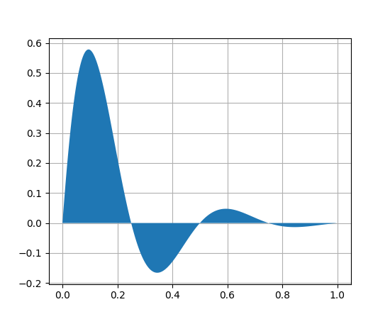

Simple Notebook Example
=======================

This provides a notebook that demonstrates the different
features available in the `sphinxcontrib.jupyter <https://github.com/QuantEcon/sphinxcontrib-jupyter>`__
extension.

Text will appear as a markdown cell in the notebook split by code-blocks. 

To add a code block you can use ``code-block`` directives such as:

.. code-block:: python3

    %matplotlib inline

.. code-block:: python3

    """
    ==================
    A simple Fill plot
    ==================

    This example showcases the most basic fill plot a user can do with matplotlib.
    """
    import numpy as np
    import matplotlib.pyplot as plt

    x = np.linspace(0, 1, 500)
    y = np.sin(4 * np.pi * x) * np.exp(-5 * x)

    fig, ax = plt.subplots()

    ax.fill(x, y, zorder=10)
    ax.grid(True, zorder=5)
    plt.show()

Figures can be include using the **figure** directive

Math 
----

Math will flow through to the Jupyter notebook and will be rendered in place by mathjax

.. math::

    \mathbb P\{z = v \mid x \}
    = \begin{cases} 
        f_0(v) & \mbox{if } x = x_0, \\
        f_1(v) & \mbox{if } x = x_1
    \end{cases} 

Tables
------

The extension supports the conversion of **simple** rst tables.

+------------+------------+-----------+ 
| Header 1   | Header 2   | Header 3  | 
+============+============+===========+ 
| body row 1 | column 2   | column 3  | 
+------------+------------+-----------+ 
| body row 2 | column 2   | column 3  | 
+------------+------------+-----------+ 